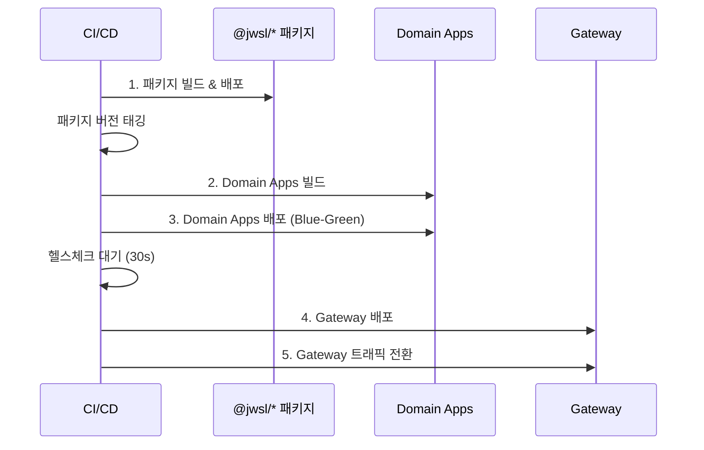
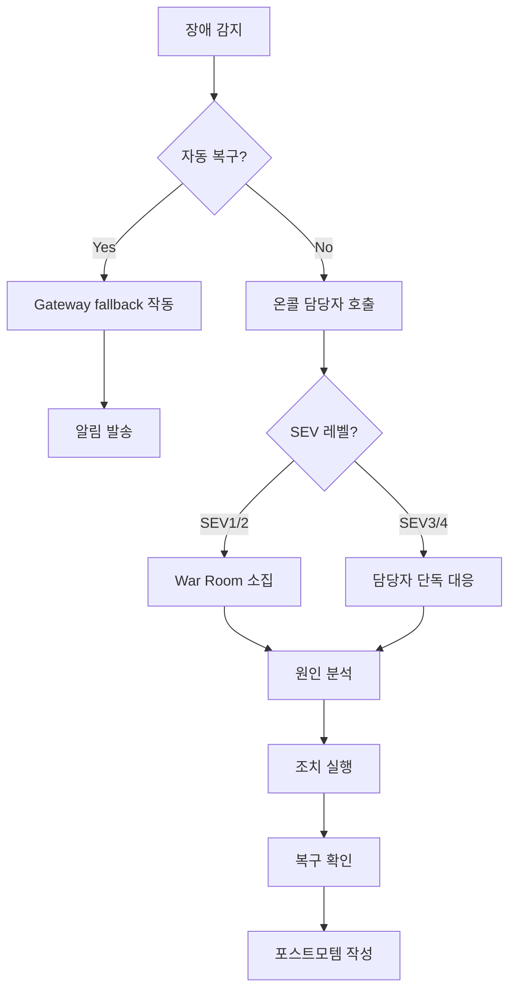

# jw-ui-framework 정책 문서 (MUST)

> 이 문서는 **필수 준수 정책**만 포함합니다. 위반 시 CI에서 빌드가 차단됩니다.

## 목차

1. [문서 우선 원칙](#문서-우선-원칙)
2. [Standards](#standards)
3. [Hook 사용 정책](#hook-사용-정책)
4. [Next Runtime Layer (@jwsl/next)](#next-runtime-layer-jwslnext)
5. [Security Headers](#security-headers)
6. [Deployment Model](#deployment-model)
7. [환경변수 정책](#환경변수-정책)
8. [Gateway ↔ Domain API 계약](#gateway--domain-api-계약)
9. [Operational Guardrails](#operational-guardrails)
10. [Error Handling Policy](#error-handling-policy)
11. [배포 파이프라인](#배포-파이프라인)
12. [인시던트 대응](#인시던트-대응)
13. [로컬 개발 환경 설정](#로컬-개발-환경-설정)
14. [Feature 의존성 검증](#feature-의존성-검증)
15. [Breaking Change 관리](#breaking-change-관리)
16. [부록: CI 검증 스크립트 요약](#부록-ci-검증-스크립트-요약)
17. [부록: 패키지 레이어 구조](#부록-패키지-레이어-구조)

---

## 문서 우선 원칙

- 이 문서는 코드보다 우선한다.
- 예시 코드는 **로직 설계 및 구조**만 제공한다. 정확한 구현은 이 문서의 구조/정책을 기준으로 결정한다.
- 기술 스택 기준:
  - **Next.js**: 16 이상 필수
  - **React**: **19.2.x 고정** (`@jwsl/react`를 통해 버전 관리)
  - 반드시 `@jwsl/react`, `@jwsl/next` wrapper를 통해 사용
- Gateway: SSR App Router 필수
- 업무도메인: App/Page Router 중 선택 (create-app.sh 반영됨)
- **필수**: 화면 개발은 `@jwsl/lib`의 Hook과 유틸리티 사용
- **필수**: 모든 앱은 `react`, `next`를 **`@jwsl/react`, `@jwsl/next`로 추상화**하여 중앙 버전 관리 활성화
- **금지**: Next.js 16 미만, React 19.2.x 외 버전은 **보안 및 호환성 이슈로 사용 금지**
- **금지**: `react`, `react-dom`, `next`를 `dependencies`에 직접 선언 (Turbopack용 `devDependencies`는 예외)

---

## Standards

### 업무도메인 생성 정책

업무도메인은 2가지 형태 중 하나로 생성/운영된다:

| 모드 | 설명 | 배포 대상 | 특징 |
|------|------|----------|------|
| **Domain App** | `app` 또는 `pages`로 생성되는 독립 Next.js 앱 | 배포 대상 | 자체 라우팅, basePath 설정 필요 |
| **Screen** | `screen`으로 생성되는 화면 패키지 | 배포 대상 아님 | Gateway가 직접 import/render |

- **Domain App은 Gateway 런타임 코드에 의존/import 금지.** (`@jwsl/gateway`는 Gateway 전용)

### 렌더링 정책고 원칙
- Server Component 우선: 데이터 페칭, 정적 UI는 무조건 서버
- Client Component 최소화: 인터랙션(입력, 상태)만 클라이언트
- props drilling 최소화: 서버 컴포넌트끼리는 직접 데이터 전달

### Screen 모드 정책

Screen 모드는 독립 Next.js 앱이 아닌 **UI 패키지**로 동작한다:

- Gateway가 직접 import하여 렌더링
- `@jwsl/framework`의 레이아웃 컴포넌트 사용 필수
- 자체 `next.config.ts` 없음 (Gateway 설정 상속)
- `package.json`의 `main` 필드로 진입점 지정

```typescript
// Screen 패키지 구조
screens/
├── order-list/
│   ├── index.ts          // 공개 API (export)
│   ├── view/
│   │   └── index.tsx     // 메인 컴포넌트
│   ├── components/       // 내부 컴포넌트
│   └── hooks/            // 내부 훅
```

### Router 정책

- **Router mode is controlled by one env var:** `NEXT_PUBLIC_ROUTER_MODE` ∈ `app|page` (legacy alias: `pages`)
- **Router access MUST be single-entry:** Components/guards MUST use `useRouter()` / `usePathname()` from `@jwsl/core` (RouterContext)
  - Do NOT import `next/router` or `next/navigation` directly in screens
  - Do NOT implement runtime router detection in feature code

### 기타 필수 정책

- **TypeScript is the standard.** All framework packages and apps MUST be TypeScript-first.
- **Domain screen development MUST be framework-based.** Domain apps MUST compose screens using `@jwsl/framework` entry points and keep routing files thin.

### 환경 파일 규칙

| 파일 | 용도 | Git 포함 |
|------|------|----------|
| `.env.local` | 개발자 로컬 | ❌ 제외 |
| `.env.development` | 개발 서버 | ✅ 포함 |
| `.env.production` | 프로덕션 | ✅ 포함 |
| `.env.test` | 테스트 환경 | ✅ 포함 |

### Router 디렉토리 규칙

- `NEXT_PUBLIC_ROUTER_MODE=app` → use `app/` (and do not create `pages/`)
- `NEXT_PUBLIC_ROUTER_MODE=page` (or legacy `pages`) → use `pages/` (and do not create `app/`)

### 설정 파일 규칙

- `next.config.ts` is the standard. (`next.config.js` is allowed only when TS config is not possible.)

---

## Hook 사용 정책

> **CRITICAL**: 화면 개발에서 가장 중요한 정책. 위반 시 개발 시 경고, CI에서 검증.

### 원칙

화면 개발자는 React의 저수준 Hook을 직접 사용하지 않고, `@jwsl/lib/hooks`의 **선언적 Hook**을 사용한다.

### 금지 사항

```typescript
// FORBIDDEN: @jwsl/react 또는 react에서 직접 import
import { useState, useEffect } from '@jwsl/react';
import { useState, useEffect } from 'react';

// FORBIDDEN: 화면 컴포넌트에서 저수준 Hook 사용
const [value, setValue] = useState('');
useEffect(() => { ... }, []);
```

### 필수 사용 패턴

```typescript
// REQUIRED: @jwsl/lib/hooks에서 선언적 Hook import
import { 
  useFormState, 
  useListState, 
  useToggle, 
  useLoading,
  useMount,
  useUpdateEffect 
} from '@jwsl/lib/hooks';
```

### Hook 대체 매핑표

| 기존 패턴 | 대체 Hook | 용도 |
|-----------|-----------|------|
| `useState` (단일 값) | `useFormState` | 폼 상태, 단일/다중 값 관리 |
| `useState` (배열) | `useListState` | 리스트 데이터 관리 |
| `useState` (boolean) | `useToggle` | on/off 토글 상태 |
| `useState` (로딩) | `useLoading` | 로딩 상태 + 에러 처리 |
| `useEffect` (마운트 시) | `useMount` | 컴포넌트 마운트 시 1회 실행 |
| `useEffect` (deps 변경 시) | `useUpdateEffect` | 의존성 변경 시 실행 (초기 실행 제외) |

### 사용 예시

#### useFormState - 폼/단일 값 관리

```typescript
// Before (금지)
const [username, setUsername] = useState('');
const [password, setPassword] = useState('');
const [error, setError] = useState('');

// After (필수)
const form = useFormState({
  initialValues: {
    username: '',
    password: '',
    error: '',
  },
});

// 사용
<input value={form.values.username} onChange={(e) => form.setValue('username', e.target.value)} />
form.setValues({ username: 'new', password: 'value' });
form.reset();
```

#### useListState - 리스트 관리

```typescript
// Before (금지)
const [items, setItems] = useState<Item[]>([]);
setItems(prev => [...prev, newItem]);
setItems(prev => prev.filter(i => i.id !== id));

// After (필수)
const items = useListState<Item>([]);

items.append(newItem);
items.prepend(newItem);
items.remove(index);
items.filter(item => item.active);
items.setState(newList);
```

#### useToggle - Boolean 상태

```typescript
// Before (금지)
const [isOpen, setIsOpen] = useState(false);
setIsOpen(prev => !prev);

// After (필수)
const [isOpen, { toggle, setTrue, setFalse }] = useToggle(false);

toggle();      // 토글
setTrue();     // true로 설정
setFalse();    // false로 설정
```

#### useMount / useUpdateEffect - 생명주기

```typescript
// Before (금지)
useEffect(() => {
  fetchData();
}, []);

useEffect(() => {
  if (id) refetch(id);
}, [id]);

// After (필수)
useMount(() => {
  fetchData();
});

useUpdateEffect(() => {
  refetch(id);
}, [id]);
```

### CI 검증 규칙

```javascript
// .eslintrc.js
module.exports = {
  rules: {
    'no-restricted-imports': ['error', {
      paths: [
        {
          name: '@jwsl/react',
          importNames: ['useState', 'useEffect'],
          message: '화면 개발에서 useState/useEffect 직접 사용 금지. @jwsl/lib/hooks의 선언적 Hook을 사용하세요.'
        },
        {
          name: 'react',
          importNames: ['useState', 'useEffect'],
          message: 'react 직접 import 금지. @jwsl/lib/hooks를 사용하세요.'
        }
      ]
    }]
  }
};
```

### 예외 사항

화면 개발 코드에서는 예외가 없다. (싱글소스 모델 포함)

`@jwsl/react`의 저수준 Hook 직접 사용은 다음 범위에서만 허용한다:

1. **프레임워크/패키지 개발** (`@jwsl/*` 패키지 내부)
2. **Hook 모듈 개발** (`@jwsl/lib/hooks` 내부 및 확장)

---

## Next Runtime Layer (@jwsl/next)

### 목적과 역할

`@jwsl/next`는 Next.js 런타임을 **플랫폼 레이어로 승격**시켜 버전, 구성, 미들웨어 정책을 중앙에서 통제하기 위한 래퍼 패키지다.

- **접근 통제**: Next.js 직접 사용을 금지하고 단일 진입점으로 통합
- **버전 중앙화**: 모든 도메인/게이트웨이가 동일 런타임 버전을 사용
- **정책 표준화**: 구성과 미들웨어를 플랫폼 정책으로 고정

### 아키텍처 원칙

1. **Single Entry Principle**: Next.js 접근은 `@jwsl/next`로만 허용
2. **Centralized Versioning**: 런타임 버전은 플랫폼에서만 변경
3. **Policy as Code**: 미들웨어와 구성은 정책 모듈로 선언하고 재사용
4. **Gateway Ownership**: 런타임 정책의 최종 결정권은 Gateway가 가짐

### 운영/개발 책임 분리

| 역할 | 책임 |
|------|------|
| **도메인 팀** | 정책 사용만. 버전, 미들웨어, 설정 책임 없음 |
| **플랫폼 팀** | 버전 업그레이드와 정책 변경 책임 집중 |

### 의존성 규칙

| 대상 | 허용 의존성 | 금지 의존성 | 비고 |
|------|-------------|-------------|------|
| Domain/Gateway | `@jwsl/next: workspace:*` | `next` (dependencies) | 워크스페이스 의존만 허용 |
| Domain/Gateway | `@jwsl/react: workspace:*` | `react`, `react-dom` (dependencies) | 워크스페이스 의존만 허용 |
| @jwsl/next | `next: >=16.0.0` (peerDep) | - | 최소 버전 16 이상 |
| @jwsl/react | `react: ^19.2.0` (peerDep) | - | **19.2.x 고정** |

### Turbopack 호환성 예외

Turbopack 빌드 시 `next`, `react`가 resolvable해야 합니다. 다음 **하나의 방법만** 사용:

#### 방법 1: 워크스페이스 루트 pnpm.overrides (권장)

```jsonc
// 루트 package.json
{
  "pnpm": {
    "overrides": {
      "next": "16.1.1",
      "react": "^19.2.0",
      "react-dom": "^19.2.0"
    }
  }
}
```

#### 방법 2: devDependencies 제한적 허용

`dependencies`가 아닌 `devDependencies`에만 허용 (빌드 도구용):

```jsonc
// 앱 package.json
{
  "dependencies": {
    "@jwsl/next": "workspace:*",    // OK: 허용
    "@jwsl/react": "workspace:*",   // OK: 허용
    // "next": "...",               // FORBIDDEN
    // "react": "..."               // FORBIDDEN
  },
  "devDependencies": {
    "next": "16.1.1",               // WARN: Turbopack용으로만 허용
    "react": "^19.2.0",             // WARN: 타입 체크용으로만 허용
    "react-dom": "^19.2.0"          // WARN: 타입 체크용으로만 허용
  }
}
```

#### 방법 3: .npmrc hoist 패턴

```ini
# .npmrc
public-hoist-pattern[]=next
public-hoist-pattern[]=react
public-hoist-pattern[]=react-dom
```

### CI 검증 규칙 (의존성)

```bash
#!/bin/bash
# scripts/check-direct-deps.sh
# dependencies에 next/react/react-dom 직접 선언 검사 (devDependencies는 허용)

for pkg in $(find . -name "package.json" -not -path "*/node_modules/*" -not -path "./package.json"); do
  # dependencies 블록에서만 검사 (devDependencies 제외)
  if jq -e '.dependencies | has("next") or has("react") or has("react-dom")' "$pkg" > /dev/null 2>&1; then
    echo "[ERROR] Policy violation: $pkg has next/react/react-dom in dependencies"
    exit 1
  fi
done
echo "[OK] Dependency policy check passed"
```

### Import 규칙

다음 규칙 위반 시 CI에서 실패한다.

| 허용 | 금지 |
|------|------|
| `@jwsl/next/navigation` | `next/navigation` |
| `@jwsl/next/link` | `next/link` |
| `@jwsl/next/image` | `next/image` |
| `@jwsl/next/dynamic` | `next/dynamic` |
| - | `next/router` |
| - | `next/*` (모든 직접 import) |

### CI 검증 규칙

#### Import 금지 검증

```javascript
// .eslintrc.js
module.exports = {
  rules: {
    'no-restricted-imports': ['error', {
      patterns: [
        {
          group: ['next/*', 'next'],
          message: 'next 직접 import 금지. @jwsl/next를 사용하세요.'
        }
      ]
    }]
  }
};
```

#### 버전 단일화 검증

```bash
# CI 스크립트
pnpm ls @jwsl/next --depth=0
# 단일 버전만 허용
```

### 정책 위반 → CI 자동 차단

| 위반 유형 | 검증 방법 | 결과 |
|-----------|----------|------|
| `dependencies`에 `next`/`react`/`react-dom` 선언 | `check-direct-deps.sh` | 빌드 실패 |
| `next/*` 직접 import | ESLint `no-restricted-imports` | ESLint 실패 |
| `@jwsl/next` 버전 불일치 | `pnpm ls` | pnpm 실패 |
| `useState`/`useEffect` 직접 사용 | ESLint `no-restricted-imports` | ESLint 실패 |

> **예외**: `devDependencies`의 `next`/`react`/`react-dom`은 Turbopack/타입체크용으로 허용

---

## Security Headers

Gateway `middleware.ts`에서 다음 헤더 필수 설정:

| 헤더 | 값 | 설명 |
|------|-----|------|
| Content-Security-Policy (CSP) | 정책에 맞게 설정 | XSS 방지 |
| Strict-Transport-Security (HSTS) | `max-age=31536000; includeSubDomains` | HTTPS 강제 |
| X-Content-Type-Options | `nosniff` | MIME 스니핑 방지 |
| Referrer-Policy | `strict-origin-when-cross-origin` | 리퍼러 정보 제한 |

---

## Deployment Model

배포 모델은 아래 2가지 중 **하나를 반드시 선택**하고, 선택된 모델에 맞춰 CI/CD, 패키지 배포, 빌드 전략을 고정한다.

### Monorepo (권장)

- Gateway 및 도메인 앱은 하나의 Git repository 내에 존재
- pnpm workspace로 의존성 관리
- Turborepo로 빌드 캐싱 및 병렬화

### Multi-repo

- Gateway 및 도메인 앱이 각각 별도의 Git repository로 분리
- npm registry를 통한 패키지 배포 필요
- 버전 동기화 자동화 필수

---

## 환경변수 정책

### 중앙집중 환경설정 정책 (필수)

- **모든 환경설정 변수 접근은 `@jwsl/_configs`에서만 허용**한다.
- 각 패키지(@jwsl/*)는 `process.env`를 직접 참조하지 말고, 반드시 `@jwsl/_configs`가 제공하는 설정/유틸리티를 사용해야 한다.
- 프레임웍(@jwsl/framework) 동작은 `@jwsl/_configs`의 설정을 기준으로 구성되며, 하위 패키지들도 동일한 설정을 사용한다.

```ts
// ✅ REQUIRED: @jwsl/_configs 사용
import { API_CONFIG } from '@jwsl/_configs/api';
import { APP_CONFIG } from '@jwsl/_configs/app';
import { getString, isProduction } from '@jwsl/_configs/env';

// ❌ FORBIDDEN: 패키지 내부에서 process.env 직접 접근
// const mode = process.env.NEXT_PUBLIC_ROUTER_MODE;
```

### 필수 환경변수 (Gateway)

| 변수명 | 타입 | 필수 | 기본값 | 설명 |
|--------|------|------|--------|------|
| `GATEWAY_DOMAINS` | string | MUST | - | 도메인 목록 (쉼표 구분) |
| `NEXT_PUBLIC_ROUTER_MODE` | `app\|page` | MUST | - | Router 모드 결정 |
| `AUTH_SECRET` | string | MUST | - | 인증 토큰 서명 키 |

### 필수 환경변수 (Domain App)

| 변수명 | 타입 | 필수 | 기본값 | 설명 |
|--------|------|------|--------|------|
| `NEXT_PUBLIC_ROUTER_MODE` | `app\|page` | MUST | - | Router 모드 결정 |
| `NEXT_PUBLIC_API_URL` | path | MUST | `/api` | API 프록시 경로 (절대 URL 금지) |

---

## Gateway ↔ Domain API 계약

### 헬스체크 응답 스키마

```typescript
// GET /<domain>/healthz
interface HealthzResponse {
  status: 'ok' | 'degraded';
  timestamp: string;  // ISO 8601
  version: string;    // 앱 버전
}

// GET /<domain>/readyz (optional)
interface ReadyzResponse {
  status: 'ok' | 'not_ready';
  checks: {
    database: 'ok' | 'fail';
    cache: 'ok' | 'fail';
    external_api: 'ok' | 'fail';
  };
  timestamp: string;
}
```

### 헤더 전파 규칙

| 헤더 | 방향 | 필수 | 설명 |
|------|------|------|------|
| `x-request-id` | Gateway → Domain | MUST | 요청 추적 ID |

### 에러 응답 표준

```typescript
interface ErrorResponse {
  error: {
    code: string;       // 'AUTH_EXPIRED', 'FORBIDDEN', 'NOT_FOUND'
    message: string;    // 사용자 표시용 메시지
    details?: unknown;  // 디버깅용 상세 (프로덕션에서 제외)
    requestId: string;  // x-request-id 값
  };
}
```

---

## Operational Guardrails

### Router mode semantics

- `NEXT_PUBLIC_ROUTER_MODE`는 **build-time contract**이다. 배포된 아티팩트는 정확히 하나의 router directory만 포함해야 한다.
  - `NEXT_PUBLIC_ROUTER_MODE=app` → `app/` exists AND `pages/` MUST NOT exist
  - `NEXT_PUBLIC_ROUTER_MODE=page` → `pages/` exists AND `app/` MUST NOT exist
- CI MUST fail fast if the directory exclusivity rule is violated

#### CI 검증 스크립트: Router 디렉토리 상호 배제

```bash
#!/bin/bash
# scripts/check-router-exclusivity.sh
# Router 디렉토리 상호 배제 검증 (빌드 전 실행)

set -e

check_app() {
  local app_dir="$1"
  local env_file="$app_dir/.env.local"
  
  # .env.local 또는 .env.production에서 ROUTER_MODE 읽기
  if [ -f "$app_dir/.env.production" ]; then
    env_file="$app_dir/.env.production"
  fi
  
  if [ ! -f "$env_file" ]; then
    echo "[WARN] $app_dir: No env file found, skipping router check"
    return 0
  fi
  
  local router_mode=$(grep "NEXT_PUBLIC_ROUTER_MODE" "$env_file" | cut -d'=' -f2 | tr -d '"' | tr -d "'")
  
  local has_app_dir=false
  local has_pages_dir=false
  
  [ -d "$app_dir/app" ] && has_app_dir=true
  [ -d "$app_dir/pages" ] && has_pages_dir=true
  
  if [ "$router_mode" = "app" ]; then
    if [ "$has_pages_dir" = true ]; then
      echo "[ERROR] $app_dir: ROUTER_MODE=app but pages/ directory exists"
      exit 1
    fi
    if [ "$has_app_dir" = false ]; then
      echo "[ERROR] $app_dir: ROUTER_MODE=app but app/ directory missing"
      exit 1
    fi
  elif [ "$router_mode" = "page" ] || [ "$router_mode" = "pages" ]; then
    if [ "$has_app_dir" = true ]; then
      echo "[ERROR] $app_dir: ROUTER_MODE=page but app/ directory exists"
      exit 1
    fi
    if [ "$has_pages_dir" = false ]; then
      echo "[ERROR] $app_dir: ROUTER_MODE=page but pages/ directory missing"
      exit 1
    fi
  fi
  
  echo "[OK] $app_dir: Router directory exclusivity verified (mode=$router_mode)"
}

# 모든 도메인 앱 검사 (gateway 제외 - gateway는 항상 app)
for app in gateway order cart payment; do
  if [ -d "$app" ]; then
    check_app "$app"
  fi
done

echo "[OK] All router directory checks passed"
```

**실행 위치**: CI 파이프라인의 빌드 단계 전 (lint 단계와 함께)

```yaml
# .github/workflows/ci.yml (예시)
jobs:
  validate:
    steps:
      - name: Check router directory exclusivity
        run: ./scripts/check-router-exclusivity.sh
```

### Router access policy

- Router mode is decided once at application bootstrap (CoreProvider) and injected via RouterContext
- Feature code uses `@jwsl/core` RouterContext hooks only: `useRouter()` and `usePathname()`
- MUST NOT: Re-export router hooks from `@jwsl/framework` for consumer usage
- MUST NOT: Use runtime router detection utilities in consumer code

### Gateway ↔ Domain contract

- Each domain app MUST set `basePath` to its domain prefix (e.g., `/order`, `/cart`, `/payment`)
- Each domain app MUST expose a lightweight health endpoint: `GET /<domain>/healthz` → `200 OK`
- Gateway rewrites MUST include static asset paths under the domain prefix (e.g., `/<domain>/_next/*`)
- Gateway MUST reserve: `/maintenance`, `/login`, `/403`

### Observability contract

- Gateway MUST issue `x-request-id` when missing and MUST propagate it to domain apps
- Access logs MUST include: `request_id`, `method`, `path`, `status`, `latency_ms`, `upstream_domain`, `client_ip`

### Auth & cookie contract

- Gateway is the authentication authority. Domain apps MUST NOT set or mutate auth cookies.
- Auth cookies:
  - `Path=/` (not per-domain path)
  - `HttpOnly=true` for session cookies
  - `Secure=true` in production
  - `SameSite=Lax` (default)

### Resilience defaults

- Gateway resilience decisions MUST be low-latency. Do not perform per-request upstream health probes in production without caching.
- Use cached health state with a short TTL:
  - Health probe timeout: `300ms`
  - Cache TTL: `5s`
  - Circuit open duration: `30s` after consecutive failures (e.g., 3)
- When a domain is unhealthy, Gateway MUST redirect to `/maintenance` with enough context to render a domain-specific UX

### Policy enforcement in CI

- Domain apps MUST NOT depend on `@jwsl/gateway`
- CI MUST validate env file presence for each deployable app

#### CI 검증 스크립트: @jwsl/gateway 의존 금지

```bash
#!/bin/bash
# scripts/check-gateway-dep.sh
# Domain 앱의 @jwsl/gateway 의존 금지 검증

set -e

for pkg in $(find . -name "package.json" -not -path "*/node_modules/*" -not -path "./gateway/*"); do
  if grep -q '"@jwsl/gateway"' "$pkg" 2>/dev/null; then
    echo "[ERROR] Policy violation: $pkg depends on @jwsl/gateway"
    exit 1
  fi
done

echo "[OK] No domain app depends on @jwsl/gateway"
```

#### CI 검증 스크립트: 환경 파일 존재 검증

```bash
#!/bin/bash
# scripts/check-env-files.sh
# 배포 대상 앱의 환경 파일 존재 검증

set -e

# 필수 환경 파일 목록
REQUIRED_ENV_FILES=(".env.development" ".env.production")

# 배포 대상 앱 목록 (Screen 모드 제외)
DEPLOYABLE_APPS=("gateway" "order" "cart" "payment")

check_env_files() {
  local app_dir="$1"
  
  if [ ! -d "$app_dir" ]; then
    echo "[WARN] $app_dir: Directory not found, skipping"
    return 0
  fi
  
  # Screen 모드인지 확인 (next.config.ts 없으면 Screen)
  if [ ! -f "$app_dir/next.config.ts" ] && [ ! -f "$app_dir/next.config.js" ]; then
    echo "[INFO] $app_dir: Screen mode (no next.config), skipping env check"
    return 0
  fi
  
  for env_file in "${REQUIRED_ENV_FILES[@]}"; do
    if [ ! -f "$app_dir/$env_file" ]; then
      echo "[ERROR] $app_dir: Missing required env file: $env_file"
      exit 1
    fi
  done
  
  # 필수 환경변수 존재 확인
  local env_prod="$app_dir/.env.production"
  if [ -f "$env_prod" ]; then
    if ! grep -q "NEXT_PUBLIC_ROUTER_MODE" "$env_prod"; then
      echo "[ERROR] $app_dir: Missing NEXT_PUBLIC_ROUTER_MODE in .env.production"
      exit 1
    fi
  fi
  
  echo "[OK] $app_dir: All required env files present"
}

for app in "${DEPLOYABLE_APPS[@]}"; do
  check_env_files "$app"
done

echo "[OK] All env file checks passed"
```

**실행 위치**: CI 파이프라인의 validate 단계

```yaml
# .github/workflows/ci.yml (예시)
jobs:
  validate:
    steps:
      - name: Check direct dependencies
        run: ./scripts/check-direct-deps.sh
      
      - name: Check router directory exclusivity
        run: ./scripts/check-router-exclusivity.sh
      
      - name: Check gateway dependency
        run: ./scripts/check-gateway-dep.sh
      
      - name: Check env files
        run: ./scripts/check-env-files.sh
```

---

## Error Handling Policy

### Error Boundary 계층 구조

`CoreProvider`를 마운트하면 L1/L2/API 에러 처리가 **기본값으로 자동 적용**됩니다.
개발자가 별도로 fallback을 주입하지 않아도 `DefaultErrorUI` 또는 기본 모달이 브라우저에 표시되며, 개발 환경에서는 콘솔에 상세 에러 정보가 자동 출력됩니다.

```
Level 1: Root Error Boundary (최상위) — CoreProvider 내장, MUST
├── 위치: CoreProvider 최상위 (자동 마운트)
├── 책임: 렌더링 에러 캐치, 전역 fallback UI, burst 감지(1초 5회 → 무한루프 차단)
├── 기본 동작: DefaultErrorUI 전체화면 표시 + 재시도 버튼
├── 커스텀: CoreProvider의 errorFallback prop으로 교체 가능
└── 제공: @jwsl/core의 ErrorBoundary

Level 2: Init Error Boundary (초기화) — CoreProvider 내장, MUST
├── 위치: CoreProvider 내부 CoreInitChecker (자동 마운트)
├── 책임: Context 초기화 에러/타임아웃(30초) 처리, 프레임워크 init 에러
├── 기본 동작: DefaultErrorUI + 재시도/홈 버튼 + 트러블슈팅 팁
├── 커스텀: CoreProvider의 errorFallback prop으로 교체 가능
└── 제공: @jwsl/core의 CoreInitChecker

API Error: Global Modal — CoreProvider 내장, MUST
├── 위치: CoreProvider 내부 ApiErrorModal (자동 마운트)
├── 책임: API 에러(4xx/5xx) 전역 모달 표시, 재시도 지원
├── 기본 동작: CSS-in-JS 기본 모달 팝업 + 에러코드/상태 + 재시도/확인 버튼
├── 커스텀: CoreProvider의 renderApiError prop으로 교체 가능
└── 제공: @jwsl/core의 ApiErrorModal

Level 3: Feature Error Boundary (기능 단위) — 선택
├── 위치: 각 Feature 루트 (개발자가 필요 시 래핑)
├── 책임: 기능별 에러 격리, 부분 재시도 UI
├── 기본 동작: fallback 미지정 시 DefaultErrorUI 표시
└── 제공: @jwsl/core의 ErrorBoundary 또는 커스텀
```

### 에러 유형별 처리 정책

| 에러 유형 | 처리 레이어 | 사용자 UI | 로깅 |
|-----------|------------|-----------|------|
| 네트워크 에러 (4xx/5xx) | ApiErrorModal (자동) | 전역 모달 팝업 + 재시도 | 관측성 로그 |
| 인증 만료 (401) | Gateway middleware | 로그인 리다이렉트 | 세션 로그 |
| 권한 없음 (403) | Gateway middleware | /403 페이지 | 접근 로그 |
| 렌더링 에러 | Error Boundary (자동) | DefaultErrorUI + 재시도 | 콘솔(dev) + Sentry(prod) |
| 초기화 에러 | CoreInitChecker (자동) | DefaultErrorUI + 재시도/홈 | 콘솔(dev) + onError 콜백 |
| 치명적 에러 (burst) | Root Boundary (자동) | critical DefaultErrorUI + 새로고침 | 긴급 알림 |

### 필수 구현 사항

- 모든 Domain App은 `CoreProvider`를 마운트 (L1/L2/API 에러 처리 자동 포함)
- 에러 발생 시 `x-request-id`를 포함하여 로깅
- App Router 사용 시 `error.tsx`, `global-error.tsx` 파일로 라우트별 에러 처리
- Feature 단위 격리가 필요한 경우 `@jwsl/core`의 `ErrorBoundary`로 추가 래핑 (선택)

---

## 배포 파이프라인

### 배포 순서



### 롤백 전략

| 시나리오 | 롤백 범위 | 절차 |
|----------|----------|------|
| Domain App 장애 | 해당 Domain만 | 이전 버전 재배포, Gateway rewrites 유지 |
| Gateway 장애 | Gateway만 | 이전 Gateway 버전 롤백 |
| 패키지 장애 | 전체 | 이전 릴리즈 태그로 전체 재배포 |

### 배포 체크리스트

- [ ] @jwsl/* 패키지 버전 일치 확인
- [ ] 환경변수 설정 완료
- [ ] 헬스체크 엔드포인트 응답 확인
- [ ] E2E Smoke Test 통과
- [ ] 모니터링 대시보드 정상
- [ ] 롤백 준비 완료

---

## 인시던트 대응

### 인시던트 레벨 정의

| 레벨 | 정의 | 영향 범위 | 대응 시간 |
|------|------|----------|----------|
| **SEV1** | 전체 서비스 중단 | 모든 사용자 | 15분 내 대응 |
| **SEV2** | 핵심 기능 장애 | 50% 이상 사용자 | 30분 내 대응 |
| **SEV3** | 일부 기능 장애 | 일부 사용자 | 2시간 내 대응 |
| **SEV4** | 성능 저하 | 경미한 영향 | 다음 업무일 |

### 대응 플로우



### 연락처 및 에스컬레이션

| 순서 | 역할 | 연락 방법 | 에스컬레이션 조건 |
|------|------|----------|------------------|
| 1 | 온콜 엔지니어 | PagerDuty | 기본 담당 |
| 2 | 팀 리드 | 전화 | 15분 무응답 시 |
| 3 | 플랫폼 팀장 | 전화 | SEV1 또는 30분 미해결 |
| 4 | CTO | 전화 | SEV1 1시간 미해결 |

---

## 로컬 개발 환경 설정

### 사전 요구사항

| 도구 | 최소 버전 | 설치 확인 |
|------|----------|----------|
| Node.js | 18.x 이상 | `node -v` |
| pnpm | 8.x 이상 | `pnpm -v` |
| Git | 2.x 이상 | `git --version` |

### 초기 설정

```bash
# 1. 저장소 클론
git clone <repository-url>
cd project-root

# 2. 의존성 설치
pnpm install

# 3. 환경변수 설정
cp gateway/.env.example gateway/.env.local
cp order/.env.example order/.env.local

# 4. 개발 서버 실행
pnpm dev:all  # Gateway + 모든 Domain App
```

### 포트 할당

| 앱 | 기본 포트 | 환경변수 |
|----|----------|----------|
| Gateway | 3000 | `PORT=3000` |
| order | 3101 | `PORT=3101` |
| cart | 3102 | `PORT=3102` |
| payment | 3103 | `PORT=3103` |
| Backend API | 8080 | - |

### 자동화 스크립트

| 스크립트 | 용도 |
|----------|------|
| `pnpm route:generate` | 메뉴 JSON 기반 라우트 레지스트리 자동 생성 |
| `pnpm check:screen-app` | 화면 개발 정책 검증 |
| `pnpm clean` | 빌드 산출물 정리 |

---

## Feature 의존성 검증

### ESLint 규칙

```javascript
// .eslintrc.js
module.exports = {
  rules: {
    'no-restricted-imports': ['error', {
      patterns: [
        {
          group: ['../**/components/*', '../**/hooks/*', '../**/api/*'],
          message: 'Feature 내부 import 금지. index.ts 공개 API만 사용하세요.'
        }
      ]
    }],
    'import/no-cycle': 'error'  // 순환 의존 금지
  }
};
```

### 허용/금지 명세

```typescript
// OK: Feature 공개 API (index.ts)
import { OrderList, useOrderList } from '@/order-list';

// OK: @jwsl/* 패키지
import { Button } from '@jwsl/ui';
import { useFormState } from '@jwsl/lib/hooks';

// FORBIDDEN: Feature 내부 직접 접근
import { OrderListTable } from '@/order-list/components/OrderListTable';

// FORBIDDEN: 순환 의존
// order-list -> order-detail -> order-list (cycle)
```

### CI 검증 스크립트

```bash
#!/bin/bash
# scripts/check-feature-deps.sh
npx madge --circular --extensions ts,tsx src/
if [ $? -ne 0 ]; then
  echo "순환 의존 발견! PR 머지 차단."
  exit 1
fi
```

---

## Breaking Change 관리

### CHANGELOG 작성 규칙

모든 @jwsl/* 패키지는 [Keep a Changelog](https://keepachangelog.com/) 형식을 따른다.

```markdown
# Changelog

## [2.0.0] - 2026-02-01

### BREAKING CHANGES
- `useRouter()` 반환 타입 변경: `router.push()` -> `router.navigate()`

### 마이그레이션 가이드
// Before (v1.x)
const { push } = useRouter();
push('/order');

// After (v2.x)
const { navigate } = useRouter();
navigate('/order');
```

### Deprecation 정책

| 단계 | 기간 | 조치 |
|------|------|------|
| 1. 공지 | 1개월 전 | `@deprecated` JSDoc + console.warn |
| 2. 유지 | 1개월 | 기존 API 유지, 경고 로그 |
| 3. 제거 | Major 버전 | API 제거, CHANGELOG 기록 |

---

## 부록: CI 검증 스크립트 요약

### 스크립트 목록

| 스크립트 | 검증 대상 | 위치 참조 |
|----------|----------|----------|
| `check-direct-deps.sh` | dependencies에 next/react/react-dom 직접 선언 | [Turbopack 호환성 예외](#turbopack-호환성-예외) |
| `check-router-exclusivity.sh` | Router 디렉토리 상호 배제 (app vs pages) | [Router mode semantics](#router-mode-semantics) |
| `check-gateway-dep.sh` | Domain 앱의 @jwsl/gateway 의존 금지 | [Policy enforcement in CI](#policy-enforcement-in-ci) |
| `check-env-files.sh` | 배포 대상 앱의 환경 파일 존재 | [Policy enforcement in CI](#policy-enforcement-in-ci) |
| `check-feature-deps.sh` | Feature 순환 의존 검사 | [Feature 의존성 검증](#feature-의존성-검증) |

### CI 파이프라인 통합 예시

```yaml
# .github/workflows/ci.yml
name: CI

on:
  push:
    branches: [main, dev]
  pull_request:
    branches: [main, dev]

jobs:
  validate:
    runs-on: ubuntu-latest
    steps:
      - uses: actions/checkout@v4
      
      - name: Setup pnpm
        uses: pnpm/action-setup@v2
        with:
          version: 8
      
      - name: Setup Node.js
        uses: actions/setup-node@v4
        with:
          node-version: '20'
          cache: 'pnpm'
      
      # Policy validation (fail fast)
      - name: Check direct dependencies
        run: ./scripts/check-direct-deps.sh
      
      - name: Check router directory exclusivity
        run: ./scripts/check-router-exclusivity.sh
      
      - name: Check gateway dependency
        run: ./scripts/check-gateway-dep.sh
      
      - name: Check env files
        run: ./scripts/check-env-files.sh
      
      - name: Install dependencies
        run: pnpm install --frozen-lockfile
      
      - name: Lint
        run: pnpm lint
      
      - name: Check feature dependencies (circular)
        run: ./scripts/check-feature-deps.sh
      
      - name: Type check
        run: pnpm type-check

  build:
    needs: validate
    runs-on: ubuntu-latest
    steps:
      - uses: actions/checkout@v4
      # ... build steps
```

### 로컬 실행

```bash
# 모든 정책 검증 한 번에 실행
pnpm check:policy

# package.json scripts 예시
{
  "scripts": {
    "check:policy": "bash -c './scripts/check-direct-deps.sh && ./scripts/check-router-exclusivity.sh && ./scripts/check-gateway-dep.sh && ./scripts/check-env-files.sh'",
    "check:all": "pnpm check:policy && pnpm lint && pnpm type-check"
  }
}
```

---

## 부록: 패키지 레이어 구조

### 패키지 의존성 계층

```
┌─────────────────────────────────────────────────────────┐
│                    화면 개발 (Screens)                    │
│  - @jwsl/lib/hooks (선언적 Hook)                         │
│  - @jwsl/ui (UI 컴포넌트)                                │
│  - @jwsl/core (Router, Provider)                        │
│  - @jwsl/framework (레이아웃, 진입점)                     │
└─────────────────────────────────────────────────────────┘
                           │
                           ▼
┌─────────────────────────────────────────────────────────┐
│                 프레임워크 내부 (Internal)                 │
│  - @jwsl/react (React 래퍼, 버전 관리)                    │
│  - @jwsl/next (Next.js 래퍼, 런타임 정책)                 │
└─────────────────────────────────────────────────────────┘
                           │
                           ▼
┌─────────────────────────────────────────────────────────┐
│                   외부 라이브러리 (External)               │
│  - react, react-dom                                     │
│  - next                                                 │
└─────────────────────────────────────────────────────────┘
```

### 패키지별 역할

| 패키지 | 역할 | 화면 개발자 사용 |
|--------|------|-----------------|
| `@jwsl/lib/hooks` | 선언적 Hook 제공 | ✅ 필수 사용 |
| `@jwsl/ui` | UI 컴포넌트 | ✅ 사용 |
| `@jwsl/core` | Router, Provider, ErrorBoundary | ✅ 사용 |
| `@jwsl/framework` | 레이아웃, 앱 진입점 | ✅ 사용 |
| `@jwsl/react` | React 래퍼 (버전 관리) | ⚠️ 제한적 (타입만) |
| `@jwsl/next` | Next.js 래퍼 | ⚠️ 제한적 (import 경로만) |
| `@jwsl/gateway` | Gateway 전용 | ❌ 금지 |
